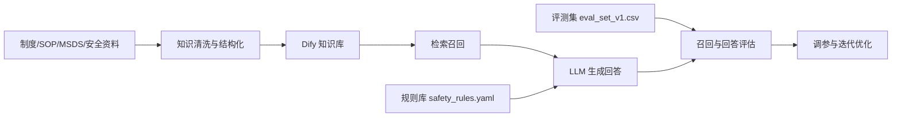

# 实验室安全小助手


面向高校实验室场景的实验室安全问答与辅助决策项目。

本项目聚焦实验室安全教育、危险操作提醒、应急处置建议和合规问答支持，当前阶段以 `Dify` 原型、结构化知识库、规则库和评测集为核心，适合作为大创申报、阶段汇报、课程展示和后续系统开发的基础仓库。

## 项目概览

在高校实验室日常管理中，学生和新成员常见的问题并不是“查不到资料”，而是很难在需要时快速得到可执行、可理解、场景化的安全建议。本项目希望构建一个“实验室安全小助手”，在保留制度约束和安全边界的前提下，为用户提供以下支持：

- 实验前安全检查提醒
- 危险操作识别与风险提示
- 常见安全问题的知识库问答
- 高风险场景下的规则化应急响应建议
- 面向项目验收的标准化评测与调参记录

## 项目目标

- 构建一个可运行的实验室安全问答原型
- 建立一套适合 Dify 的结构化知识库样例
- 设计面向安全场景的规则库与回答约束
- 形成可复用的评测集、验收指标与检索调参流程
- 为后续接入本地模型、Embedding 和混合检索打下基础

## 当前成果

当前仓库已经形成一套可用于展示和继续迭代的 MVP 材料：

- 项目申报书：包含可提交版 `docx` 和 `md` 文档
- 核心知识库：`knowledge_base_curated.csv`，覆盖化学、电气、通用应急等核心场景
- 规则库：`safety_rules.yaml`，用于约束回答方式和高风险问题处理逻辑
- 评测集：`eval_set_v1.csv`，用于验证回答质量和召回情况
- 验收标准：`eval_criteria.md`
- 调参记录：`retrieval_tuning_report.md`

当前阶段已完成的代表性工作包括：

- 清洗并重建实验室安全知识库样例
- 修正 Dify 工作流输出绑定问题
- 完成首轮召回测试与 `Top K` 调整
- 建立评测集和阶段性验收指标

## 核心能力设计

本项目当前强调以下三类能力：

### 1. 知识库问答

基于实验室安全制度、标准操作流程和场景化问答条目，为用户提供面向“通风柜、危化品、废液、消防、电气、触电应急”等问题的快速回答支持。

### 2. 规则化安全约束

对于明显危险、违规或高风险的用户提问，不仅仅返回常规答案，而是通过规则库进行安全约束，例如：

- 禁止性操作的拒答或纠偏
- 应急场景的优先处置步骤
- 强调报告、撤离、断电、隔离等高优先级动作

### 3. 可评测、可迭代

项目不是只做一个能聊天的原型，而是同步建设评测集、知识库样例、验收指标和调参记录，便于后续继续优化准确率、召回率与稳定性。

## 仓库结构

```text
lab-safety-assistant/
├─ README.md
├─ 实验室安全小助手_项目申报立项书_可提交版.docx
├─ 实验室安全小助手_项目申报立项书_可提交版.md
├─ 立项书优化稿_实验室安全小助手.md
├─ knowledge_base_curated.csv
├─ knowledge_base_template.csv
├─ knowledge_entry_schema.json
├─ knowledge_entry_template.json
├─ safety_rules.yaml
├─ safety_rules_guide.md
├─ eval_set_v1.csv
├─ eval_set_template.csv
├─ eval_criteria.md
├─ kb_build_report.md
├─ kb_clean_report.md
├─ retrieval_tuning_report.md
└─ README_MVP_START.md
```

## 推荐阅读顺序

如果你是第一次进入本仓库，建议按下面顺序查看：

1. [README.md](README.md)：快速了解项目定位与仓库内容
2. [实验室安全小助手_项目申报立项书_可提交版.md](实验室安全小助手_项目申报立项书_可提交版.md)：查看完整申报材料
3. [knowledge_base_curated.csv](knowledge_base_curated.csv)：了解当前知识库样例结构
4. [safety_rules.yaml](safety_rules.yaml)：了解规则库设计方式
5. [eval_set_v1.csv](eval_set_v1.csv) 和 [eval_criteria.md](eval_criteria.md)：了解评测与验收标准
6. [retrieval_tuning_report.md](retrieval_tuning_report.md)：查看调参过程与结论

## 技术路线

当前技术路线采用“先快速原型、后逐步增强”的思路：



当前原型以 `Dify + RAG + 规则约束` 为主。后续可进一步接入：

- Embedding 模型
- 混合检索与重排序
- 本地模型部署
- 更正式的制度文件与 MSDS 数据源

## 如何使用本仓库

本仓库当前更适合作为“项目资料仓库”和“原型迭代仓库”，而不是完整的一键部署仓库。

你可以用它来做以下事情：

- 作为大创项目申报与阶段答辩材料
- 将 `knowledge_base_curated.csv` 导入知识库系统做问答原型
- 将 `safety_rules.yaml` 作为规则设计参考
- 使用 `eval_set_v1.csv` 对问答系统进行抽样测试
- 参考 `retrieval_tuning_report.md` 继续做召回调参

## 当前边界

为了保证仓库可公开、可复用、无敏感数据，本仓库刻意不包含以下内容：

- Dify 运行数据卷
- 本地数据库与上传文件
- API 密钥与私有配置
- 临时调试输出与同步辅助脚本
- 未经整理的原始运行环境文件

这意味着当前仓库更偏向“项目核心成果集”，而不是完整运行镜像。

## 后续计划

- 补充更权威的实验室制度、SOP、MSDS 作为正式知识源
- 增加更多化学、电气、生物、消防等细分场景样本
- 引入 Embedding、混合检索和重排序，降低召回噪声
- 加入更明确的演示脚本和验收流程
- 在原型稳定后推进本地模型部署与效果对比

## 项目说明

如果你正在查看这个仓库的 GitHub 首页，可以把它理解为：

- 一个面向高校实验室安全场景的智能问答项目样例
- 一套用于大创申报和阶段展示的结构化项目资料
- 一个可继续扩展为正式系统的原型基础
