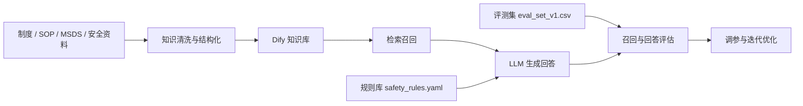
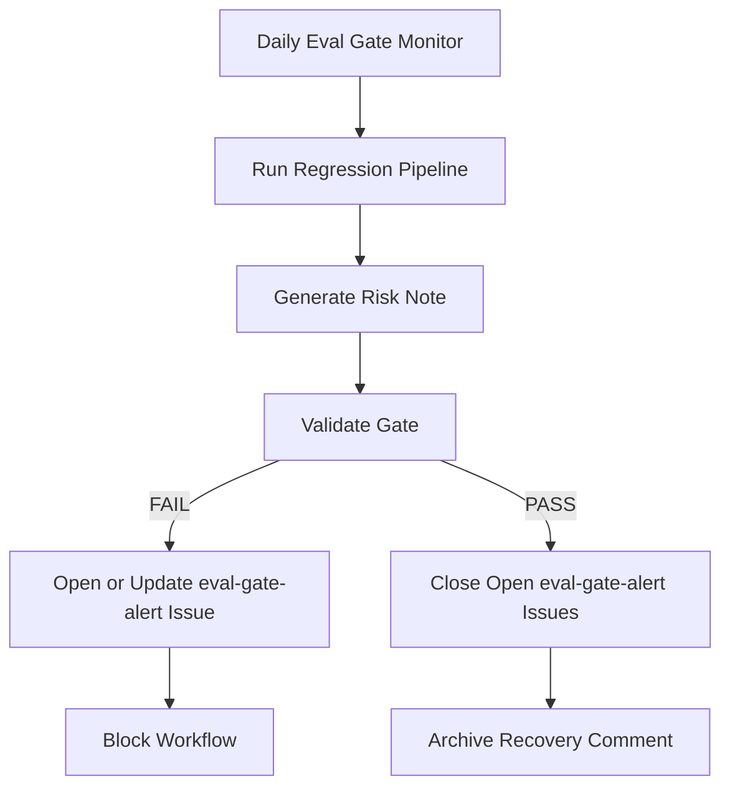

# 实验室安全小助手


面向高校实验室场景的实验室安全问答与辅助决策项目。

本项目聚焦实验室安全教育、危险操作提醒、应急处置建议和合规问答支持，当前阶段以 `Dify` 原型、结构化知识库、规则库和评测集为核心，适合作为大创申报、阶段汇报、课程展示和后续系统开发的基础仓库。

## 项目概览

高校实验室中并不缺制度文件，真正缺少的是在具体场景下“快速、可执行、可理解”的安全辅助。  
本项目希望构建一个“实验室安全小助手”，帮助用户围绕实验室制度、危险操作、应急处置和常见合规问题获得结构化回答，并逐步从原型发展为可落地的实验室安全辅助系统。

当前项目重点围绕以下能力展开：

- 实验前安全检查提醒
- 危险操作识别与风险提示
- 常见安全问题知识库问答
- 高风险场景下的规则化应急建议
- 基于评测集的回答质量验证与调参

## 项目目标

- 构建一个可运行的实验室安全问答原型
- 建立一套适合 `Dify` 的结构化知识库样例
- 设计面向安全场景的规则库与回答约束
- 形成可复用的评测集、验收指标与调参流程
- 为后续接入本地模型、Embedding 和混合检索打下基础

## 当前成果

当前仓库已经形成一套可用于展示和继续迭代的 MVP 材料：

| 文件 | 说明 |
|------|------|
| `knowledge_base_curated.csv` | 核心知识库，**81 条**结构化条目 |
| `safety_rules.yaml` | 规则库，**24 条**规则（含应急/拒答/重定向） |
| `eval_set_v1.csv` | 评测集，**50 条**测试问题 |
| `eval_criteria.md` | 验收指标 |
| `retrieval_tuning_report.md` | 检索调参记录 |
| `docs/pipeline/embedding_setup.md` | Embedding 接入指南（Ollama / 云端方案） |
| 项目申报书 | 包含可提交版 `docx` 和 `md` 文档 |

知识库覆盖场景：

- 化学实验：通风柜、危化品、废液处置、易燃溶剂、酸碱腐蚀
- MSDS 专项：丙酮、甲醇、NaOH、浓硫酸、氯仿（三氯甲烷）
- 电气安全：触电、激光、电气火灾
- 生物安全：生物安全柜、高压灭菌锅
- 物理安全：液氮/低温冻伤、离心机
- 应急处置：火灾疏散、灭火器使用、化学品溅伤
- 辐射安全：准入要求、辐射污染应急
- 管理制度：实验室分级、危化品储存量限制、剧毒品双人双锁

当前阶段已完成的代表性工作包括：

- 清洗并重建实验室安全知识库（从 25 条扩充至 81 条，含 MSDS 专项）
- 运行网络爬取流水线，从 18 个权威高校安全页面抓取并清洗知识条目
- 修正 `Dify` 工作流输出绑定问题，完成首轮召回测试与 `Top K` 调整
- 建立评测集（50 条）和阶段性验收指标
- 修复规则库 R-010 过触发问题，新增辐射/激光/低温/离心机/灭菌锅 5 类规则
- 编写 Embedding 模型接入指南（Ollama 本地方案与云端备选方案）
- 完成 GitHub 展示页与项目文档整理

## 文档导航

如果你希望快速理解项目并继续推进，建议优先阅读以下文档：

- [云端协作快速入口](./docs/ops/TEAM_CLOUD_WORKFLOW.md)
- [项目目录结构与分工说明](./docs/PROJECT_STRUCTURE.md)
- [角色1：信息收集员执行手册](./docs/ops/角色1_信息收集员执行手册_v2.md)
- [角色2：数据清洗与人工审核员执行手册](./docs/ops/角色2_数据清洗员执行手册_v2.md)
- [角色3：发布与验收负责人执行手册](./docs/ops/角色3_发布与验收负责人执行手册_v1.md)
- [发布前人工验收记录模板](./docs/eval/release_review_log.md)
- [项目申报书（Markdown 版）](./docs/proposal/实验室安全小助手_项目申报立项书_可提交版.md)
- [演示脚本](./docs/ops/demo_script.md)
- [运行手册](./docs/ops/runbook.md)
- [全AI流水线操作手册](./docs/ops/AI全自动流水线操作手册_v1.md)
- [数据源建设方案](./docs/pipeline/data_source_plan.md)
- [低置信度待补任务处理SOP](./docs/ops/low_confidence_followup_sop_v1.md)
- [网页提取 Skill 合规说明](./docs/ops/web_content_fetch_skill_合规说明_v1.md)
- [Embedding 接入指南](./docs/pipeline/embedding_setup.md)（如何配置向量检索，替代纯关键词模式）
- [评测结果看板](./docs/eval/eval_dashboard.md)
- [V4.2 绑定与 Top10 修复手册](./docs/eval/v4_2_dify绑定与Top10修复手册_20260328.md)
- [模型通道A/B实测总结（2026-03-28）](./docs/eval/model_ab_eval_20260328_summary.md)
- [评测链路自动降级说明（2026-03-28）](./docs/eval/failover_eval_pipeline_20260328.md)
- [response_route 分桶门禁说明（2026-03-28）](./docs/eval/route_bucket_gate_20260328.md)
- [评测集](./eval_set_v1.csv)
- [验收指标](./eval_criteria.md)
- [检索调参记录](./retrieval_tuning_report.md)
- [答辩技术证据页](./docs/eval/defense_tech_evidence.md)

## 核心能力设计

### 1. 知识库问答

基于实验室安全制度、标准操作流程和场景化问答条目，为用户提供面向“通风柜、危化品、废液、消防、电气、触电应急”等问题的快速回答支持。

### 2. 规则化安全约束

对于明显危险、违规或高风险的用户提问，不仅仅返回常规答案，而是通过规则库进行安全约束，例如：

- 禁止性操作的拒答或纠偏
- 应急场景的优先处置步骤
- 强调报告、撤离、断电、隔离等高优先级动作

### 3. 可评测、可迭代

项目不是只做一个能聊天的原型，而是同步建设评测集、知识库样例、验收指标和调参记录，便于后续继续优化准确率、召回率与稳定性。

### 4. 网页提取技能化

已新增可复用 Skill：`skills/web-content-fetcher`，用于“先提取正文，再总结/入库”的多通道网页抓取流程（`jina -> scrapling -> direct`）。
并已接入主流水线：`scripts/web_ingest_pipeline.py --fetcher-mode auto|skill|legacy`。
并已接入统一入口：`scripts/unified_kb_pipeline.py --web-fetcher-mode auto|skill|legacy`。

## 仓库结构

```text
lab-safety-assistant/
├─ README.md
├─ docs/
│  ├─ guides/                   ← 快速入门与规则指南
│  ├─ ops/                      ← 协作流程、SOP、运行与部署
│  ├─ pipeline/                 ← 数据入库、抓取、清洗流水线文档
│  ├─ eval/                     ← 评测看板、发布验收与门禁记录
│  ├─ proposal/                 ← 立项书（md/docx）
│  ├─ reports/                  ← 阶段报告（构建/清洗/状态）
│  ├─ word/                     ← 角色执行手册（Word）
│  └─ PROJECT_STRUCTURE.md      ← 目录规范与分工说明
├─ templates/                   ← 模板与 schema（KB/Eval）
├─ scripts/                     ← 数据入库、评测、门禁自动化脚本
├─ data_sources/                ← URL 种子、manifest、预抓取状态
├─ manual_sources/              ← 人工补录入口（inbox/approved/rejected）
├─ artifacts/                   ← 脚本运行产物
├─ web_demo/                    ← 演示页面与接口
├─ knowledge_base_curated.csv   ← 主知识库（81 条）
├─ safety_rules.yaml            ← 规则库（24 条）
├─ eval_set_v1.csv              ← 评测集（50 条）
├─ eval_criteria.md             ← 验收指标
└─ retrieval_tuning_report.md   ← 检索调参记录
```

## 技术路线

当前技术路线采用“先快速原型、后逐步增强”的思路：



当前原型以 `Dify + RAG + 规则约束` 为主，后续可进一步接入：

- **Embedding 模型**（已有接入指南，见 `docs/pipeline/embedding_setup.md`；推荐 Ollama + bge-m3）
- **混合检索与重排序**（配置 Embedding 后可在 Dify 工作流一键启用）
- 本地模型部署
- 更多正式制度文件与 `MSDS` 数据源

## 如何使用本仓库

本仓库当前更适合作为“项目资料仓库”和“原型迭代仓库”，而不是完整的一键部署仓库。

你可以用它来做以下事情：

- 作为大创项目申报与阶段答辩材料
- 将 `knowledge_base_curated.csv` 导入知识库系统做问答原型
- 将 `safety_rules.yaml` 作为规则设计参考
- 使用 `eval_set_v1.csv` 对问答系统进行抽样测试
- 参考 `retrieval_tuning_report.md` 继续做召回调参
- 参考 `docs/ops/runbook.md` 和 `docs/ops/demo_script.md` 完成复现与演示准备

## 质量与安全门禁

为避免“改动能跑但不可控”的问题，仓库已提供最小质量门：

- 提交前密钥扫描：`scripts/secret_scan.py`
- 本地质量门：`scripts/quality_gate.py`
- 自动化冒烟评测：`scripts/eval_smoke.py`
- 人工复核与汇总：`scripts/eval_review.py`
- 回归流水线与看板刷新：`scripts/run_eval_regression_pipeline.py`
- 最小单测：`tests/`（`pytest`）
- GitHub Actions：`.github/workflows/quality-gate.yml`

推荐命令：

```powershell
# 1) 安装并启用 pre-commit（本地提交拦截）
pip install pre-commit
pre-commit install

# 2) 全仓质量门检查（schema + 规则 ID + secret scan）
python scripts/quality_gate.py

# 3) 运行最小单测
pytest

# 4) 生成评测应答模板（人工填写或外部系统回填）
python scripts/eval_smoke.py --generate-template

# 5) 基于回填 responses.csv 生成自动评测报告
python scripts/eval_smoke.py --responses-csv <your_responses.csv>

# 6) 直接调用 Dify App API 做 smoke 评测
set DIFY_BASE_URL=http://localhost
set DIFY_APP_API_KEY=<app-xxxx>
python scripts/eval_smoke.py --use-dify --limit 10

# 7) 生成人工复核模板（从 detailed_results.csv 生成）
python scripts/eval_review.py --detailed-results <detailed_results.csv> --generate-template

# 8) 合并人工复核结果并输出最终汇总
python scripts/eval_review.py --detailed-results <detailed_results.csv> --manual-review-csv <manual_review_filled.csv>

# 9) 触发一轮真实回归并自动刷新评测看板（需配置 Dify 凭据）
set DIFY_BASE_URL=http://localhost
set DIFY_APP_API_KEY=<app-xxxx>
python scripts/run_eval_regression_pipeline.py --repo-root . --update-dashboard --dify-timeout 30 --eval-concurrency 4
```

若要启用超时自动降级（主通道失败后切备用通道）：

```powershell
set DIFY_FALLBACK_BASE_URL=http://localhost:8080
set DIFY_FALLBACK_APP_API_KEY=<app-backup-xxxx>
python scripts/run_eval_regression_pipeline.py --repo-root . --update-dashboard --dify-timeout 30 --eval-concurrency 4 --retry-on-timeout 1
```

回归完成后会额外生成失败修复清单，方便你直接按题修：

- `.../eval_failure_clusters.csv`（失败原因分簇）
- `.../eval_failure_clusters.md`（失败原因报告）
- `.../eval_top10_fix_list.csv`（Top10 优先修复题单）

看板门禁说明：

- 已启用 `docs/eval/eval_dashboard_gate_enabled.flag`
- 质量门会执行 `scripts/validate_eval_dashboard_gate.py`
- 当关键指标连续两周低于阈值时，质量门失败（阻止发布）

## 当前边界

为了保证仓库可公开、可复用、无敏感数据，本仓库刻意不包含以下内容：

- `Dify` 运行数据卷
- 本地数据库与上传文件
- API 密钥与私有配置
- 临时调试输出与同步辅助脚本
- 未经整理的原始运行环境文件

这意味着当前仓库更偏向“项目核心成果集”，而不是完整运行镜像。

## 后续计划

- ✅ 补充 MSDS 专项知识（丙酮/甲醇/NaOH/浓硫酸/氯仿）
- ✅ 增加辐射、激光、低温、离心机、灭菌锅等细分场景样本
- ✅ 完善规则库，修复 R-010 过触发，新增 R-020~R-024
- ✅ 已验证 Embedding 模型接入（参考 `docs/pipeline/embedding_setup.md` 与 `retrieval_tuning_report.md`）
- 补充更权威的制度文件 `SOP` 原文作为正式知识源
- 在原型稳定后推进本地模型部署与回答质量对比评测

## 项目说明

如果你正在查看这个仓库的 GitHub 首页，可以把它理解为：

- 一个面向高校实验室安全场景的智能问答项目样例
- 一套用于大创申报和阶段展示的结构化项目资料
- 一个可继续扩展为正式系统的原型基础

## Release Gate Override & Risk Note

- Gate script: `scripts/validate_eval_dashboard_gate.py`
- One-click release chain: `python scripts/run_eval_release_oneclick.py --repo-root . --workflow-id <workflow_id>`
- Windows wrapper: `powershell -ExecutionPolicy Bypass -File scripts/run_eval_release_oneclick.ps1 -RepoRoot . -WorkflowId <workflow_id>`
- Exit code semantics for one-click chain: `0=pass`, `2=blocked_by_gate`, `1=step_error`.
- Override config: `docs/eval/eval_dashboard_gate_override.json`
- Override template: `docs/eval/eval_dashboard_gate_override.example.json`
- Auto risk note: `python scripts/generate_release_risk_note.py --repo-root .`
- Pipeline behavior: when running `scripts/run_eval_regression_pipeline.py --update-dashboard`, risk note files are refreshed automatically (use `--skip-risk-note` to disable).
- Daily monitor workflow: `.github/workflows/daily-eval-gate-monitor.yml` (auto runs pipeline + gate, and opens/updates `eval-gate-alert` issue on failure)
- Daily monitor now runs dual policy checks (`demo` + `prod`, both strict) and treats `demo` as default hard gate.
- `prod` policy can run in warning mode or hard-block mode via repo variable `EVAL_POLICY_ENFORCE_PROD` (`true/false`).
- Same-day dedup + SLA check: daily monitor keeps one issue per day and enforces `Owner`/`DDL` fields; missing SLA is marked with red `sla-missing` label.
- Escalation policy: if gate fails for 3 consecutive days, workflow adds `p1-gate` label and @mentions escalation owners from repo variable `EVAL_GATE_ESCALATION_MENTIONS`.
- Postmortem reminder: for open `p1-gate` issues older than 24h, workflow posts one reminder per day until recovery; template at `docs/eval/p1_postmortem_template.md`.
- Configurable thresholds: `EVAL_GATE_ESCALATION_STREAK_DAYS` and `EVAL_GATE_REMINDER_HOURS_LIST` (for example `24,48,72`).
- Weekly ops summary: `docs/eval/weekly_gate_ops.md` generated by `scripts/generate_weekly_gate_ops.py` via weekly-report workflow.
- Release policy config: `docs/eval/release_policy_v5.json` (supports `demo`/`prod` profiles).
- Release policy validator: `python scripts/validate_release_policy.py --repo-root . --profile demo --strict`.
- Release readiness dashboard: `python scripts/generate_release_readiness_dashboard.py --repo-root . --profiles demo,prod --strict-profiles demo,prod`.
- Dashboard outputs: `docs/eval/release_readiness_dashboard.md` and `docs/eval/release_blocker_topn.md`.
- Manual workflow: `.github/workflows/release-policy-check.yml` (workflow_dispatch).
- One-click chain can run secondary policy too: `--release-policy-run-secondary --release-policy-secondary-profile prod`.
- Secondary policy can be enforced as hard gate with `--release-policy-enforce-secondary`.

### Alert-to-Recovery Flow



