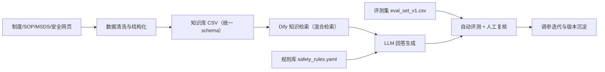

# 实验室安全小助手：技术路线与迭代证据页（答辩版）

> 更新时间：2026-03-31  
> 适用场景：大创中期/结题答辩、课程项目技术汇报、导师评审

## 1. 项目一句话定位

本项目是一个面向高校实验室安全场景的 **RAG + 规则约束** 智能问答原型，目标不是“泛聊天”，而是“在高风险场景下给出可执行、可追溯、可评测的安全回答”。

## 2. 技术路线（可直接讲）

## 3. 当前成果快照（截至 2026-03-31）

- 主知识库：`knowledge_base_curated.csv`（81 条，29 字段）
- 规则库：`safety_rules.yaml`（24 条）
- 评测集：`eval_set_v1.csv`（50 条）
- 检索状态：高质量索引 + 混合检索（向量 0.7 + 关键词 0.3）
- 质量门：`secret_scan + quality_gate + pytest + GitHub Actions`
- 线上知识库正式导入：`398` 条成功，`0` 条失败
- 最新正式回归：`20/20`
- 连续 3 轮真实回归：`3/3 PASS`

## 4. 迭代证据（有文件可追溯）

| 迭代阶段 | 关键动作 | 证据文件 | 结果 |
|---|---|---|---|
| v1 原型 | 经济模式检索 + 基础 KB 构建 | `retrieval_tuning_report.md` | 能命中核心问题，但噪声偏高 |
| v2 检索升级 | 接入 bge-m3，切换高质量+混合检索 | `docs/pipeline/embedding_setup.md`、`retrieval_tuning_report.md` | 召回相关性明显提升，噪声下降 |
| v3 数据扩展 | 补充 MSDS 与细分场景条目 | `knowledge_base_curated.csv`、`scripts/_add_msds_entries.py`、`scripts/_add_new_entries.py` | 覆盖更完整，演示可用性增强 |
| v4 评测体系 | 50 条评测集 + 指标体系 | `eval_set_v1.csv`、`eval_criteria.md` | 具备可重复评估能力 |
| v5 工程治理 | 提交前安全扫描、CI 质量门、单测接入 | `.pre-commit-config.yaml`、`.github/workflows/quality-gate.yml`、`tests/` | 降低泄露与回归风险 |
| v6 评测升级 | 自动评测 + 人工复核模板与汇总 | `scripts/eval_smoke.py`、`scripts/eval_review.py` | 支持“自动初筛 + 人工校正”闭环 |
| v7 线上闭环 | Dify 工作流修复、知识库正式导入、20题正式回归 | `docs/eval/formal_acceptance_20260331.md`、`docs/eval/release_stability_check.md` | 已达到可演示、可答辩、可继续扩展的交付状态 |
| v8 性能收口 | 输出长度收敛、三轮稳定性证据固化 | `docs/eval/stability_evidence_3round_20260331.md` | 正确率稳定达标，延迟进入继续优化阶段 |

## 5. 为什么这个路线可行

1. **可落地**：不依赖大规模训练，依靠结构化知识与规则先交付可用系统。  
2. **可控**：高风险问题可通过规则约束和拒答策略做安全边界。  
3. **可验证**：有评测集、有指标、有报告，不是“凭感觉优化”。  
4. **可演进**：后续可平滑接入 rerank、多知识库、工具节点。  

## 6. 现场答辩可讲的 90 秒版本

1. 我们把项目拆成三层：**知识层（KB）—检索层（RAG）—安全层（规则）**。  
2. 第一阶段先做出可用 MVP，解决“能答”的问题；第二阶段升级混合检索，解决“答得准”的问题。  
3. 当前线上知识库已正式导入 398 条内容，最新 20 题正式回归达到 `20/20`。  
4. 连续 3 轮真实回归全部通过，说明结果不是偶然命中。  
5. 在工程治理上，我们新增了密钥扫描、质量门和 CI 测试，确保后续迭代可持续。  
6. 下一步会继续补充正式 SOP/MSDS 数据源，并引入更细粒度的人工评测指标。  

## 7. 下一步计划（可作为老师追问的回答）

- 数据侧：补齐机械安全、压力容器、辐射源标准作业条目。  
- 检索侧：在混合检索稳定后评估 rerank 模型收益。  
- 评测侧：人工复核完成率提升到 100%，形成版本对比基线。  
- 产品侧：按场景拆分节点（常规问答 / 危险纠偏 / 应急流程）提升可解释性。  

