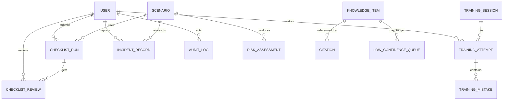

# 实验安全前置哨 — 数据库设计补充稿（2026-05-11）

> 目标：给当前“文件型持久化”补一份清晰的逻辑数据模型，方便答辩、后续迁移 SQLite、以及老师/管理员查看系统是否真的闭环。

## 1. 总体策略

### 1.1 当前实现方式

MVP 阶段采用：

- CSV：运行记录、清单记录、培训记录、事故记录、低置信队列
- JSON：应急卡片、培训题库
- YAML：安全规则
- CSV 主知识库：`knowledge_base_curated.csv`

### 1.2 设计原则

1. **先文件，后数据库**：先保证答辩展示和快速迭代。
2. **逻辑模型先行**：先把实体关系理清，方便未来迁移。
3. **可迁移**：未来可平滑迁移到 SQLite / PostgreSQL。
4. **可追溯**：关键业务要保留时间戳、角色、动作、原因。

---

## 2. 逻辑 ER 模型

---

## 3. 实体与表结构建议

> 下表是逻辑设计，不强制要求当前阶段全部落成关系数据库。

### 3.1 `user`

| 字段 | 类型 | 说明 |
|---|---|---|
| id | string | 主键 |
| username | string | 登录名 / 展示名 |
| display_name | string | 显示名称 |
| role | enum | student / teacher / admin / maintainer |
| class_name | string | 班级（可空） |
| lab_group | string | 实验组（可空） |
| created_at | datetime | 创建时间 |

### 3.2 `scenario`

| 字段 | 类型 | 说明 |
|---|---|---|
| id | string | 场景 ID |
| title | string | 场景名称 |
| description | text | 场景描述 |
| hazard_tags | string[] | 危险类型 |
| created_by | string | 创建人 |
| created_at | datetime | 创建时间 |

### 3.3 `risk_assessment`

| 字段 | 类型 | 说明 |
|---|---|---|
| id | string | 主键 |
| scenario_id | string | 关联场景 |
| risk_score | int | 1-5 |
| risk_level | string | Low / Medium-Low / Medium / High / Critical |
| key_hazards | string[] | 危险标签 |
| ppe | string[] | 建议 PPE |
| forbidden | string[] | 禁止事项 |
| emergency_actions | string[] | 应急动作 |
| citations_json | json | 引用列表 |
| created_at | datetime | 评估时间 |

### 3.4 `checklist_run`

| 字段 | 类型 | 说明 |
|---|---|---|
| record_id | string | 主键 |
| scenario_id | string | 场景 |
| operator_id | string | 提交人 |
| risk_score | int | 风险分数 |
| risk_level | string | 风险等级 |
| allow_start | bool | 是否允许开工 |
| blocking_reasons | string[] | 阻断原因 |
| items_json | json | 全量清单勾选状态 |
| review_status | enum | pending / approved / rejected |
| created_at | datetime | 提交时间 |

### 3.5 `checklist_review`

| 字段 | 类型 | 说明 |
|---|---|---|
| id | string | 主键 |
| checklist_run_id | string | 关联清单 |
| reviewer_id | string | 审核人 |
| action | enum | approve / reject |
| comment | text | 审核意见 |
| reviewed_at | datetime | 审核时间 |

### 3.6 `low_confidence_queue`

| 字段 | 类型 | 说明 |
|---|---|---|
| id | string | 主键 |
| question_hash | string | 去重哈希 |
| question | text | 原始问题 |
| mode | string | lab / agent |
| decision | string | 决策标签 |
| low_confidence_reason | text | 低置信原因 |
| top_score | float | 检索最高分 |
| top_kb_id | string | 命中文档 |
| status | enum | open / in_review / resolved |
| created_at | datetime | 入队时间 |

### 3.7 `training_session`

| 字段 | 类型 | 说明 |
|---|---|---|
| session_id | string | 主键 |
| total_questions | int | 题数 |
| pass_threshold | int | 分数线 |
| created_at | datetime | 生成时间 |

### 3.8 `training_attempt`

| 字段 | 类型 | 说明 |
|---|---|---|
| attempt_id | string | 主键 |
| session_id | string | 关联题目 session |
| participant | string | 作答者 |
| score | int | 分数 |
| passed | bool | 是否通过 |
| weak_categories | string[] | 薄弱类别 |
| submitted_at | datetime | 提交时间 |

### 3.9 `incident_record`

| 字段 | 类型 | 说明 |
|---|---|---|
| incident_id | string | 主键 |
| reporter | string | 上报人 |
| title | string | 标题 |
| scenario | text | 事故场景 |
| severity | enum | low / medium / high / critical |
| status | enum | open / in_review / action_in_progress / verified / closed |
| owner | string | 整改责任人 |
| due_date | date | 截止日期 |
| closure_notes | text | 结案说明 |
| recurrence_risk | string | 复发风险 |
| overdue | bool | 是否逾期 |

### 3.10 `knowledge_item`

| 字段 | 类型 | 说明 |
|---|---|---|
| id | string | KB 编号 |
| title | string | 条目标题 |
| source_title | string | 来源标题 |
| source_org | string | 来源单位 |
| source_url | string | 来源链接 |
| risk_level | string | 风险等级 |
| category | string | 分类 |
| hazard_types | string[] | 危险类型 |
| answer | text | 答案正文 |
| steps | text | 步骤 |
| forbidden | text | 禁止事项 |
| emergency | text | 应急措施 |
| ppe | text | PPE 建议 |

### 3.11 `audit_log`

| 字段 | 类型 | 说明 |
|---|---|---|
| id | string | 主键 |
| actor | string | 操作人 |
| action | string | 操作动作 |
| target_type | string | 目标类型 |
| target_id | string | 目标 ID |
| payload_json | json | 变更内容 |
| created_at | datetime | 时间戳 |

---

## 4. 现有文件映射

| 逻辑实体 | 当前文件 |
|---|---|
| knowledge_item | `knowledge_base_curated.csv` |
| checklist_run | `artifacts/checklists/checklist_runs.csv` |
| checklist_review | `artifacts/checklists/checklist_runs.csv`（同表字段承载） |
| low_confidence_queue | `artifacts/low_confidence_followups/data_gap_queue.csv` |
| training_attempt | `artifacts/training/training_attempts.csv` |
| training_mistake | `artifacts/training/training_mistakes.csv` |
| incident_record | `artifacts/incidents/incident_reviews.csv` |
| training_session | 内存生成，当前未独立落盘 |
| audit_log | 当前未单独落盘，建议后续新增 |

---

## 5. 迁移建议

### 5.1 当前阶段

继续使用文件型存储，优点：

- 答辩展示轻量
- 易于人工查看
- 不需要迁移脚本

### 5.2 下一阶段：SQLite

建议优先迁移的表：

1. `checklist_run`
2. `checklist_review`
3. `training_attempt`
4. `incident_record`
5. `low_confidence_queue`

### 5.3 最终阶段：PostgreSQL

如果需要真实试点并发写入、统计和审计，再迁移到 PostgreSQL。

---

## 6. 竞争力判断

对于当前项目，数据库设计最重要的不是“看起来像大型系统”，而是：

1. 结构清晰，能支撑答辩；
2. 记录完整，能支撑审核；
3. 迁移路径明确，能支撑后续扩展。

这三点已经足够让项目比“只有前端页面的 AI Demo”更有竞争力。

