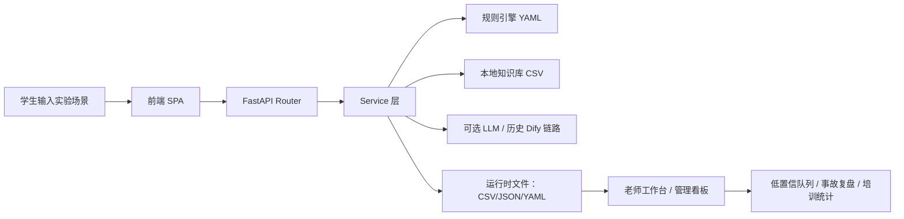
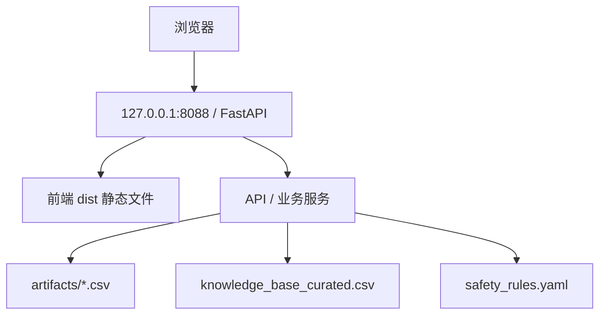

# 实验安全前置哨 — 系统设计补充稿（2026-05-11）

> 目标：把当前项目从“能演示”进一步收敛为“更有竞争力、可答辩、可维护、可扩展”的展示型 MVP。
> 设计原则：**不重构成微服务，不引入不必要的复杂度；优先把闭环做强，把证据做实，把展示做稳。**

## 1. 设计结论

### 1.1 架构选择

**结论：保留单体 + 模块化架构，不上微服务。**

理由：

1. 当前阶段目标是课程 / 大创展示，不是大规模并发生产系统。
2. 项目核心价值在“实验前安全决策闭环”，而不是基础设施复杂度。
3. 单体架构更适合快速调试、快速演示、快速修复。
4. 当前代码已经天然分层：`routers -> services -> repositories -> data/files`。

### 1.2 技术栈

| 层级 | 选型 | 说明 |
|---|---|---|
| 前端 | Vite + TypeScript + Tailwind CSS | 轻量、快、易演示 |
| 后端 | FastAPI | 接口清晰、类型友好、适合原型迭代 |
| 数据 | CSV / JSON / YAML | 可读、可改、便于答辩说明 |
| 规则 | YAML 规则引擎 | 安全边界可配置、可追溯 |
| 检索 | 本地知识库 + token 检索 + 可选语义检索 | 兼顾准确性与可降级 |
| 模型 | OpenAI-compatible / Dify 历史链路 | 保留兼容，但不作为主依赖 |

### 1.3 核心设计目标

- **安全确定性**：高风险场景先规则阻断，再进入回答链路。
- **可解释**：输出要说明“为什么阻断 / 为什么建议老师确认”。
- **可追踪**：每次提交、审核、低置信入队都要留痕。
- **可展示**：首页、风险、清单、老师审核、看板五个页面构成主线。
- **可扩展**：未来可平滑迁移到 SQLite / PostgreSQL，但不抢跑。

---

## 2. 系统架构

### 2.1 模块分工

| 模块 | 职责 |
|---|---|
| `web_demo/app.py` | FastAPI 总入口、静态资源、SPA fallback |
| `web_demo/routers/` | 接口路由层，只做参数接收和响应输出 |
| `web_demo/services/` | 业务逻辑层，负责风险评估、清单、看板、培训等 |
| `web_demo/repositories.py` | 数据文件路径、缓存、常量、知识库读取 |
| `web_demo/frontend/src/` | 页面渲染、组件、API 调用、路由 |

### 2.2 页面设计

建议把前端 UI 固定为 5 个核心页面 + 3 个辅助页面：

#### 核心主线
1. **安全问答**
2. **风险评估**
3. **开工检查**
4. **老师工作台**
5. **管理看板**

#### 辅助能力
1. **应急卡片**
2. **培训考核**
3. **事故记录 / 系统状态**

### 2.3 UI/UX 原则

| 原则 | 落地方式 |
|---|---|
| 一眼看懂 | 风险结果用红/黄/绿三色卡片呈现 |
| 一眼知道下一步 | 页面直接展示“可开工 / 需老师确认 / 暂不可开工” |
| 一眼知道缺什么 | 阻断原因必须是具体检查项，不允许只写“请注意安全” |
| 一眼能给老师看 | 老师工作台一屏展示风险、缺失项、建议动作 |
| 一眼能给评委看 | 看板展示阻断率、低置信问题、高风险场景、培训通过率 |

### 2.4 安全设计

#### 2.4.1 权限思路

当前答辩 / MVP 阶段不强制上线完整登录系统，但角色视角必须存在：

- 学生视角：提问、自查、提交清单
- 老师视角：审核、驳回、备注
- 管理员视角：看板、周报、导出

#### 2.4.2 安全边界

1. **规则优先于模型**：安全判断先由 YAML 规则引擎完成。
2. **高风险默认保守**：无法确认时宁可阻断，也不放行危险操作。
3. **低置信不硬答**：知识库命中不足时进入待补知识队列。
4. **输出留痕**：所有关键动作写 CSV，便于答辩举证。
5. **接口输入校验**：避免空值、超长文本、非法字段直接进入业务逻辑。

### 2.5 部署拓扑

---

## 3. 竞争力优化判断

### 3.1 需要优化，但不需要大改架构

**结论：需要优化，但优化方向应该是“更像一个可落地的安全助手”，而不是“更像一个技术堆栈展示”。**

### 3.2 最值得做的四件事

1. **把主线讲清楚**
   - 统一成“实验前判断能不能开工”
   - 避免讲成普通聊天机器人

2. **把证据做实**
   - 风险阻断率
   - 低置信问题数
   - 审核留痕
   - 评测结果

3. **把 UI 做稳**
   - 首页、风险、清单、老师工作台、看板必须稳定
   - 不追求花哨动画，追求一屏讲清楚

4. **把场景做尖**
   - 至少选 3 类典型高风险场景：化学 / 电气 / 锂电池
   - 让系统“有针对性”，而不是泛化空话

### 3.3 不建议做的事

- 不建议为了“看起来先进”切微服务
- 不建议为了“显得完整”硬加 SSO / 门禁 / 消息队列
- 不建议把更多精力放在不影响答辩的后台工程

---

## 4. 结论

当前项目**已经具备答辩基础**，但要更有竞争力，关键不是再堆功能，而是：

1. 把实验前安全门禁的故事线讲透；
2. 把规则阻断、审核、看板做成闭环；
3. 把数据、文档、测试证据补齐；
4. 把界面稳定性和演示节奏做牢。

